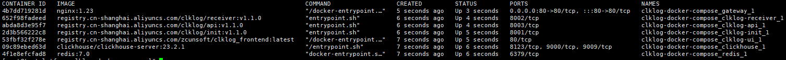
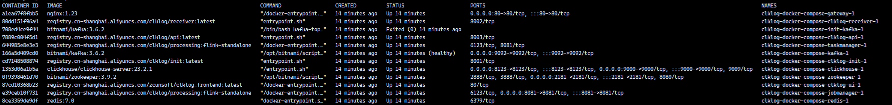
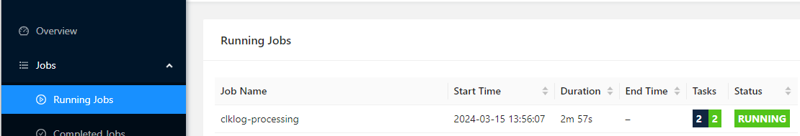

[TOC]

# docker 安装说明

## 环境准备

操作系统：Ubuntu（建议版本 22.04）

软件依赖：

- docker（建议版本24+）
- docker compose （建议使用最新的版本2.27.0)

服务器最低配置要求：

- 处理器：双核2.5GHz或更高
- 内存：8GB RAM或更高
- 存储空间：至少50GB可用硬盘空间
- 网络：可靠的网络连接，带宽至少为10Mbps

## 安装介绍

   Clklog Docker Compose包含标准模式和快速模式两种。

   快速模式：表示日志直接存入clickhouse。

   标准模式：采集日志数据先存入kafka，经由flink处理后再存入clickhouse。

   安装过程中可以根据实际需求选择采用标准模式还是快速模式，后续过程可以切换模式。

## 快速模式安装

### 准备

1. 下载 ClkLog Docker Compose配置文件，参考代码如下

- github 镜像下载

    ```
   curl -O https://github.com/clklog/clklog-deploy/raw/refs/heads/main/releases/clklog-docker-compose-1.1.0.zip

    ``

- gitee 镜像下载

    ```
   curl -O https://gitee.com/clklog/clklog-deploy/raw/main/releases/clklog-docker-compose-1.1.0.zip

    ```

2. 拷贝镜像,并解压镜像文件，参考代码如下：

    ```
    tar -zxvf clklog-docker-compose.tar.gz
    cd clklog-docker-compose 
 

3. 执行目录初始化脚本，代码如下：

    ```
    mkdir -p clklog_dc_data/redis
    chown 999 clklog_dc_data/redis
    mkdir -p   clklog_dc_data/processing/checkpoints
    chown 9999 clklog_dc_data/processing/checkpoints
    chgrp 9999 clklog_dc_data/processing/checkpoints
    mkdir -p   clklog_dc_data/zookeeper
    chown 1001 clklog_dc_data/zookeeper
    chgrp 1001 clklog_dc_data/zookeeper
    mkdir -p   clklog_dc_data/kafka
    chown 1001 clklog_dc_data/kafka
    chgrp 1001 clklog_dc_data/kafka

    ```

### 启动

1. 执行安装命令

   在`clklog-docker-compose`目录下执行以下命令：

    ```
    docker compose -f docker-compose-clklog-simple.yml up -d
    ```

2. 查看容器状态

    ```
    docker compose -f docker-compose-clklog-simple.yml ps -a
    ```

      

3. 验证镜像是否安装成功

   - 前端地址： <http://YOUR_DOMAIN/>  
       - 登录账号/密码：admin/clklog
  
   - 统计接口说明地址： <http://YOUR_DOMAIN/api/doc.html>

   - 埋点数据接收地址： <http://YOUR_DOMAIN/receiver/api/gp?project=clklogapp&token=5388ed7459ba4c4cad0c8693fb85630a>

### 埋点代码接入

   埋点代码接入方式参考：[sdk-埋点集成参考](https://clklog.com/#/integration/reference)

## 标准模式安装

### 准备

1. 下载 ClkLog Docker Compose配置文件，参考代码如下

    ```
   curl -O https://clklog.com/res/docker/clklog-docker-compose.tar.gz
    ```

2. 拷贝镜像,并解压镜像文件，参考代码如下：

    ```
    tar -zxvf clklog-docker-compose.tar.gz
    cd clklog-docker-compose 
    ```
<!-- 
3. 根据实际情况修改`.env`文件中的默认配置：

    ```
    #[Clickhouse]
    # clickhouse用户名
    CK_USER_NAME=default 
    # clickhouse密码
    CK_USER_PWD=clklogpwd 

    #[ClkLog]
    # clklog数据库名称
    CLKLOG_LOG_DB=clklog    
    ``` -->

3. 执行目录初始化脚本，代码如下：

    ```
    mkdir -p clklog_dc_data/redis
    chown 999 clklog_dc_data/redis
    mkdir -p   clklog_dc_data/processing/checkpoints
    chown 9999 clklog_dc_data/processing/checkpoints
    chgrp 9999 clklog_dc_data/processing/checkpoints
    mkdir -p   clklog_dc_data/zookeeper
    chown 1001 clklog_dc_data/zookeeper
    chgrp 1001 clklog_dc_data/zookeeper
    mkdir -p   clklog_dc_data/kafka
    chown 1001 clklog_dc_data/kafka
    chgrp 1001 clklog_dc_data/kafka

    ```

### 启动

1. 执行安装命令

   在`clklog-docker-compose`目录下执行以下命令：

    ```
    docker compose -f docker-compose-clklog-full.yml up -d
    ```

2. 查看容器状态

    ```
    docker compose -f docker-compose-clklog-full.yml ps -a
    ```

      

3. 验证镜像是否安装成功

   - 前端地址： <http://YOUR_DOMAIN/>

   - 统计接口说明地址： <http://YOUR_DOMAIN/api/doc.html>

   - 埋点数据接收地址： <http://YOUR_DOMAIN/receiver/api/gp?project=clklogapp&token=5388ed7459ba4c4cad0c8693fb85630a>

   - flink后台地址： <http://YOUR_DOMAIN/flink/#/overview>，在flink后台查看job状态是否正常运行

     

### 埋点代码接入

   埋点代码接入方式参考：[sdk-埋点集成参考](https://clklog.com/#/integration/reference)

## 模式切换

### 快速模式切换标准模式

- 1. 停止并删除容器:`docker compose -f docker-compose-clklog-simple.yml down`。
- 2. 启动服务：`docker compose -f docker-compose-clklog-full.yml up -d`。
- 3. 后续步骤参考标准模式安装步骤。

### 标准模式切换快速模式

#### 方式1

- 1. 将`docker-compose-clklog-full.yml`中设置`RECEIVER_ENABLE_SIMPLE_VERSION`为`true`。
- 2. 注释`docker-compose-clklog-full.yml`文件中`kafka`,`zookeeper`,`flink(jobmanager,taskmanager)`的相关配置,并停止对应容器。
- 3. 停止并删除`clklog-receiver`容器，再执行命令：`docker compose -f docker-compose-clklog-full.yml up -d`。

#### 方式2

- 1. 停止并删除容器:`docker compose -f docker-compose-clklog-full.yml down`。
- 2. 启动服务： `docker compose -f docker-compose-clklog-simple.yml up -d`。
